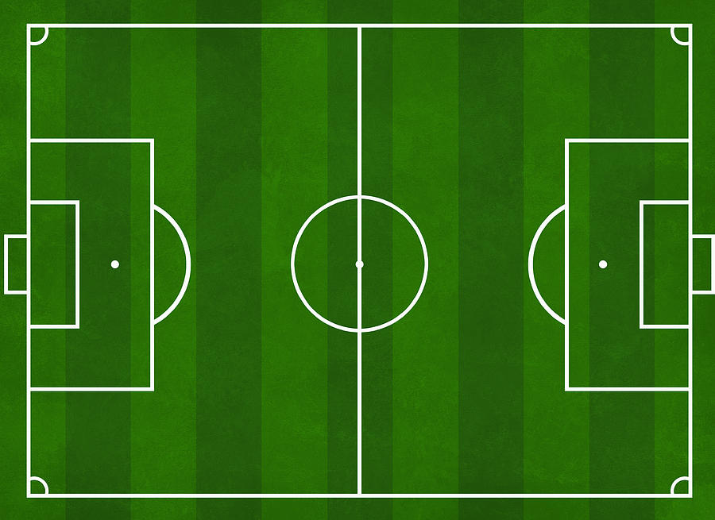
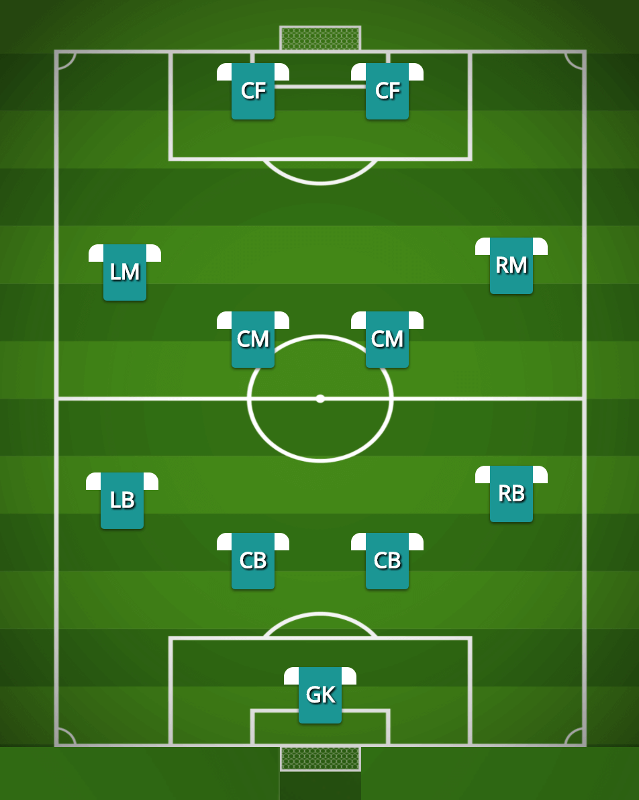
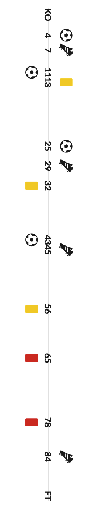

## Coach Assistant

Когато имат контролна среща (неофициален мач), помощник-треньорите по футбол обръщат специално внимание на някои компоненти от играта, които са упражнявали със своите футболисти. Например искат да знаят колко на брой добри паса е направил даден играч, колко гола е отбелязал, колко пъти е бил фаулиран и т.н. Те разполагат с една пластмасова дъска, предварително разчертана с елементите на футболното игрище. . Когато мачът започне, помощник-треньорите "поставят" играчите на тази дъска под формата на кръгчета така, както те са разположени реално на терена (схема на игра). Когато даден играч направи дадено действие (което помощник-треньорът иска да следи), той отбелязва по някакъв начин това на дъската до съответното кръгче.

Понеже дъската не е безкрайна, трудно е да се запише всичко, понякога маркерът отказва да пише, а впоследствие е трудно дори да се разчете написаното, трябва да улесним помощник-треньорите, като им напишем iOS приложение __Coach Assistant__!

Приложението ще има опция за стартиране на мач след което ще показва терена с "играчи" разположени в схема `4-4-2`.

От тези играчи, помощник-треньорът ще трябва да може да избере трима играчи "за следене". На друг екран трябва по удобен начин да може за всеки от тримата играчи да "отброява" следните действия, както и времето в което те се случват по време на игра. Примерно: жълт картон в 5 минута.

успешен пас
неуспешен пас
добро отиграване
лошо отиграване
удар във вратата
удар извън вратата
жълт картон
червен картон
отбелязан гол
получен гол
спасяване
успешна борба във въздуха
неуспешна борба във въздуха
добро центриране
лошо центриране
къс пас
дълъг пас
изчистване
шпагат

_(Някои от действията са строго за вратарски пост, моля не правете разлика полеви играч или вратар. Нека всички действия се "събират" за всеки от избраните играчи)_

При стартиране на мача нека започва да тече таймер 00:00 -> 45:00. Приложението трябва да отчита в коя минута от мача се е случило даденото действие. Нека приложението разполага с бутон "Край", който да прекъсва следенето на играта и след който да показва статистически репорт: за кой играч в коя минута кое действие се е случило (Mоже да използвате табличен вид за да представите крайния резултат. Ето една интересна интерпретация.)

Данните трябва да се съхраняват във firebase и да могат да се зареждат всички репорти които са били създадени преди. При нова инсталация, да се показват репортите от предишни сесии.  